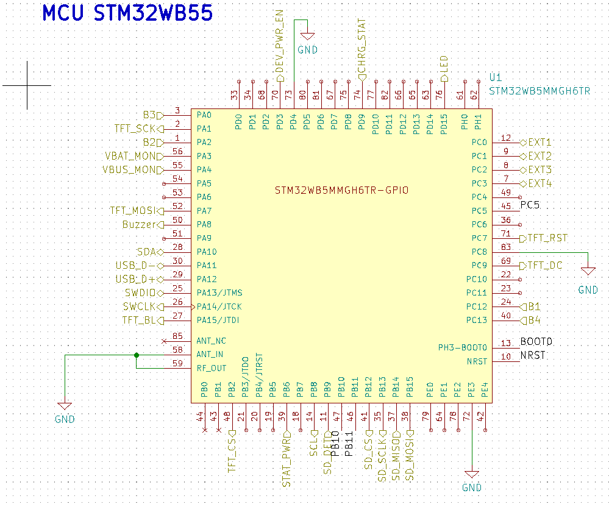

# Timers

## LPTIM1 

 Timer interne pour géré nos timins.

​	Présentement configuré à 4000 Hz ( 250us/tick)   .032Mhs( de LSI) / 8

## Buzzer

Configuré sur Timer1

Entrée à 64Mhz divisé par un prescaler de 32 = tick à 2Mhz. 

Donc on va jouer les notes en utilisant le counter  un compteur à 1000 donne 2000Hz pour le toggle (demie onde) donc une fréquence audio de 1000H (* à valider)

## Brightness Afficheur

PA 15 ( tim2 ch 1)

Periode counter à 1000 -> compatateur 500 = 50%, 1000 = 100%

Prescaler a 64000 mais pas testé, peut-êtree changer la valeur pour augmenter ou diminuer la fréquence au besoins 64 Mhz/64000 = 1000hz

# ADC

 

## Display

DIN --> D11(PA7)  User label: TFT_MOSI

clk -->D13(PA1) User label:  TFT_SCK

CS -->:D7(PB2) User label: OUT_TFT_CS

DC --> A4(PC4) User label: OUT_TFT_DC

RST -->D1(PB5) User label:  OUT_TFT_RST

BL -->A2(PA5) User label:  TFT_BL

